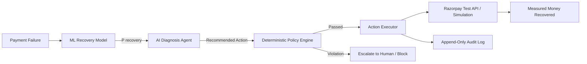

# ReviveAI — Autonomous AI Revenue Recovery Command Center

<div align="center">

[](https://python.org)
[](https://fastapi.tiangolo.com)
[](https://reactjs.org)
[](https://vitejs.dev)
[](https://xgboost.ai)
[](https://razorpay.com)
[](#-running-automated-tests)

**"An autonomous AI agent that finds slipping revenue, understands why it is at risk, chooses the safest recovery action, and executes it within strict financial guardrails."**

*Track 3: AI Revenue Recovery — Razorpay AI Buildathon 2026*

</div>

---

## 🌟 Executive Summary

Indian merchants lose 15–35% of attempted transaction volume to transient failures, network timeouts, balance issues, and authentication drops. ReviveAI transforms revenue recovery from reactive guesswork into an autonomous, bounded AI system that:

1. **Detects** slipping revenue at the transaction level.
2. **Predicts** recovery probability with an explainable XGBoost model.
3. **Diagnoses** failure root causes with contextual AI reasoning.
4. **Enforces** strict deterministic guardrails (no uncontrolled LLM money movements).
5. **Executes** bounded recovery actions (automated retries, customer nudges, payment links).
6. **Quantifies** measured money recovered and recovery lift over baseline.
7. **Maintains** an append-only audit trail for complete merchant transparency.

---

## 🏗️ Architecture: Bounded Financial Autonomy



### Key Architectural Separation

| Component | Role | Guarantee |
|---|---|---|
| **AI Diagnosis Agent** | Understands context & suggests intervention | Recommends only — zero direct execution authority |
| **Policy Engine** | Deterministic guardrail evaluation | Hard business logic (amounts, retry counters, thresholds) |
| **Action Executor** | Dispatches allowed recovery actions | Razorpay Test Mode & Simulation layer isolation |
| **Audit Trail** | Logs every decision & policy evaluation | Complete compliance and auditability |

For detailed diagrams and architectural specifications, see the [Architecture Documentation](docs/architecture.md).

---

## 🛡️ Codified Guardrails & Policies

- **Automated Retry Ceiling**: $\le$ ₹10,000 transaction amount.
- **Retry Velocity Limit**: Maximum 2 automated retries per transaction.
- **High-Value Escalation**: Transactions > ₹50,000 are **always** routed to human review.
- **Non-Retryable Classification**: Expired cards and invalid details are **never** retried; routed to Payment Links or Nudges.
- **Confidence Gate**: AI/ML confidence < 60% triggers mandatory escalation.

---

## 🚀 Quick Start (Local Setup)

### Prerequisites
- Python 3.10+
- Node.js 18+ and npm

### 1. Clone & Configure
```bash
git clone https://github.com/SAKET-2005/AI-Revenue-Recovery-System.git
cd AI-Revenue-Recovery-System
cp .env.example .env
```

### 2. Backend Setup
```bash
cd backend
pip install -r requirements.txt

# Train the ML Recovery Model
python -m scripts.train_model

# Seed the database with synthetic transactions and recovery history (from project root)
python ../scripts/seed_database.py 1000

# Start FastAPI Backend (Port 8000)
python -m uvicorn app.main:app --host 0.0.0.0 --port 8000
```

### 3. Frontend Setup
```bash
cd ../frontend
npm install
npm run dev
```

Visit **`http://localhost:5173`** to access the ReviveAI Merchant Command Center.

---

## 🧪 Running Automated Tests

ReviveAI includes comprehensive test coverage for policy guardrails, ML prediction, agent reasoning, webhook idempotency, and API endpoints:

```bash
cd backend
python -m pytest -v
```

All 18 automated tests pass and validate the core safety invariants:
```
tests/test_ml_and_executor.py::test_ml_predictor_inference PASSED
tests/test_ml_and_executor.py::test_agent_deterministic_reasoning PASSED
tests/test_ml_and_executor.py::test_action_executor_mock_retry PASSED
tests/test_ml_and_executor.py::test_action_executor_payment_link_creation PASSED
tests/test_policy_engine.py::test_high_value_transaction_is_escalated PASSED
tests/test_policy_engine.py::test_expired_card_is_not_retried PASSED
tests/test_policy_engine.py::test_retry_limit_is_enforced PASSED
tests/test_policy_engine.py::test_low_confidence_is_escalated PASSED
tests/test_policy_engine.py::test_valid_retry_is_allowed PASSED
tests/test_policy_engine.py::test_payment_link_allowed_within_probability_band PASSED
tests/test_policy_engine.py::test_insufficient_funds_never_retried PASSED
tests/test_policy_engine.py::test_authentication_failure_never_retried PASSED
tests/test_policy_engine.py::test_risk_decline_routed_to_human_review PASSED
tests/test_policy_engine.py::test_low_recovery_probability_stops PASSED
tests/test_policy_engine.py::test_retry_amount_exceeding_auto_limit_is_escalated PASSED
tests/test_webhooks_and_api.py::test_api_health_endpoint PASSED
tests/test_webhooks_and_api.py::test_webhook_idempotency_and_duplicate_rejection PASSED
tests/test_webhooks_and_api.py::test_generate_and_list_transactions PASSED
```

---

## 🎯 Interactive Demo Scenarios

The seeded dataset includes 4 deterministic showcase transactions designed to validate every core financial guardrail:

| Scenario | Transaction ID | Amount | Failure Reason | Guardrail Verdict | System Action |
|---|---|---|---|---|---|
| **1-Click Live Recovery** | `TXN_9281` | ₹4,500 | `temporary_bank_failure` | **ALLOW** | Automated retry succeeds & updates revenue |
| **High-Value Escalation** | `TXN_9282` | ₹65,000 | Exceeds ₹50k ceiling | **ESCALATE** | Mandatory routing to human merchant review |
| **Non-Retryable Failure** | `TXN_9283` | ₹3,500 | `expired_card` | **BLOCK** | Retry permanently blocked; routes to customer nudge |
| **Velocity Exhaustion** | `TXN_9284` | ₹1,800 | Prior retries $\ge 2$ | **STOP** | Halts automated recovery to prevent gateway spam |

---

## 📂 Project Structure

```
ReviveAI/
├── backend/
│   ├── app/
│   │   ├── api/            # REST Endpoints (Dashboard, Transactions, Recovery, Webhooks, Audit)
│   │   ├── agents/         # AI Recovery Agent & Deterministic Fallbacks
│   │   ├── executors/      # Action Execution Layer
│   │   ├── integrations/   # PaymentProvider (Razorpay Test Mode & Mock)
│   │   ├── ml/             # XGBoost Predictor & Training Pipeline
│   │   ├── models/         # SQLAlchemy ORM Models
│   │   ├── policies/       # Deterministic Guardrail Engine (PolicyEngine)
│   │   ├── schemas/        # Pydantic Schemas & Types
│   │   ├── services/       # Core Recovery Pipeline Service
│   │   └── utils/          # Synthetic Data Generator & Helpers
│   ├── scripts/
│   │   └── train_model.py  # Model Training Script
│   ├── tests/              # Pytest Test Suite
│   └── ml_artifacts/       # Serialized XGBoost Model & Encoders
├── frontend/
│   ├── src/
│   │   ├── components/     # UI Components, AppShell, 3D WebGL Canvas
│   │   ├── pages/          # Landing, Dashboard, Transactions, Detail, Audit, Analytics
│   │   └── lib/            # API Client, Types, and Adapters
├── docs/
│   ├── architecture.md     # In-depth architectural design & Mermaid diagrams
│   └── api.md              # Complete REST API specifications
├── scripts/
│   ├── seed_database.py    # Synthetic Data & Recovery Seeder
│   └── run_demo.py         # CLI Interactive Pipeline Verification Runner
├── .env.example
├── docker-compose.yml
└── README.md
```

Detailed technical specifications:
- [Architecture & Design Document](docs/architecture.md)
- [REST API Reference](docs/api.md)

---

## 📄 License & Disclaimer

Built for the **Razorpay AI Buildathon 2026**. All datasets use synthetic, non-PII transaction records. Razorpay gateway integrations operate in simulation and test mode.
