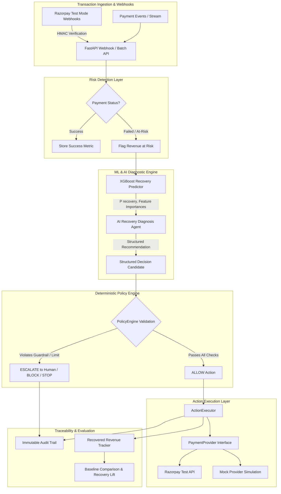
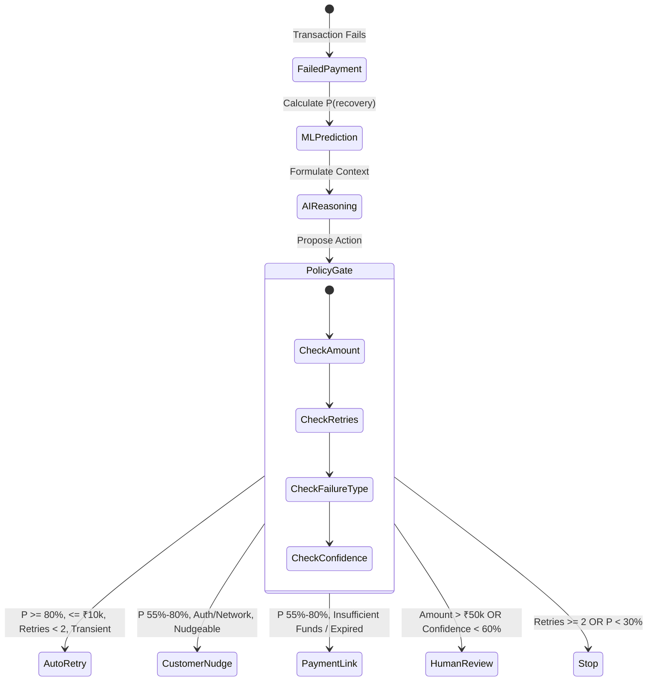

# ReviveAI — System Architecture & Design

> **Track 3: AI Revenue Recovery — Razorpay AI Buildathon 2026**
> "An autonomous AI agent that finds slipping revenue, understands why it is at risk, chooses the safest recovery action, and executes it within strict financial guardrails."

---

## 1. High-Level Architecture



---

## 2. Core Separation of Responsibilities

A key architectural principle of ReviveAI is **bounded financial autonomy**:

```
AI RECOMMENDATION  ≠  POLICY ENFORCEMENT  ≠  ACTION EXECUTION
```

| Layer | Responsibility | Technology | Why Separated? |
|---|---|---|---|
| **AI Diagnosis Agent** | Understands failure context, customer history, and provides structured recommendation | LLM / Deterministic Rule-Engine Fallback | LLMs are non-deterministic and must not have direct access to financial actions or database mutations. |
| **Deterministic Policy Engine** | Evaluates strictly codified rules (thresholds, retry counters, velocity gates, failure classifications) | Pure Python Logic (`PolicyEngine`) | Guarantees compliance, zero hallucinated payouts, and predictable merchant boundaries. |
| **Action Executor** | Dispatches allowed interventions to payment providers | `PaymentProvider` abstraction (`RazorpayPaymentProvider` / `MockPaymentProvider`) | Provides pluggable test-mode / live integration without leaking vendor logic into business rules. |

---

## 3. The 5 Recovery Interventions



1. **Automated Retry (`retry`)**:
   - Targeted at transient bank timeouts, gateway network hiccups.
   - Guardrail: Maximum 2 retries, amount $\le$ ₹10,000, recovery probability $\ge$ 80%.
2. **Customer Nudge (`customer_nudge`)**:
   - Personalized notification to prompt customer re-authentication or alternative method.
3. **Payment Link (`payment_link`)**:
   - Generates an instant, secure Razorpay/simulated recovery payment link.
   - Triggered for insufficient balance or card expiration scenarios where immediate retry is futile.
4. **Human Escalation (`human_review`)**:
   - Route high-value transactions (>₹50,000) or low-confidence predictions to merchant finance teams.
5. **Stop / Do Nothing (`stop`)**:
   - Halts further attempts when retry exhaustion is reached or risk decline is permanent.

---

## 4. Machine Learning Pipeline

### Objective
Predict $P(\text{recovery\_success} \in [0, 1])$ for any failed transaction.

### Features Engineered
- `failure_code`: Categorical encoding (transient bank failure, insufficient funds, network timeout, expired card, risk decline, etc.)
- `amount`: Transaction value in INR.
- `retry_count`: Prior retry attempts on this transaction.
- `is_returning_customer`: Boolean flag of customer loyalty.
- `transaction_frequency`: Historical monthly cadence.
- `cart_value` & `checkout_duration`: Behavioral checkout signals.
- `payment_method` & `merchant_category`: Gateway and vertical indicators.

### Model Architecture
- **Classifier**: XGBoost (`XGBClassifier`) with 200 estimators, tree depth 6, subsample ratio 0.8.
- **Split Strategy**: 70% Training / 15% Validation / 15% Holdout Test (Stratified).
- **Explainability**: Global & local feature importances surfaced in real-time in the merchant dashboard.

---

## 5. Idempotency & Webhook Security

- **HMAC SHA256 Signature Verification**: Validates `X-Razorpay-Signature` against `RAZORPAY_WEBHOOK_SECRET` when configured.
- **Deduplication Engine**: Stores event identifiers in the `webhook_events` table with unique indexing to guarantee exactly-once processing regardless of webhook retries.
- **Graceful Fallbacks**: If external APIs or LLM endpoints timeout or fail, the system falls back to deterministic decision heuristics without crashing or losing events.
